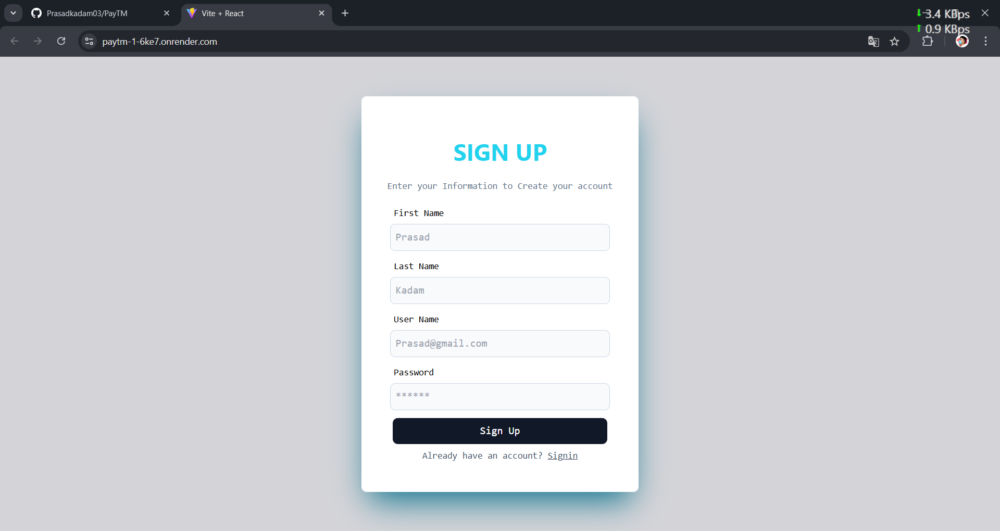
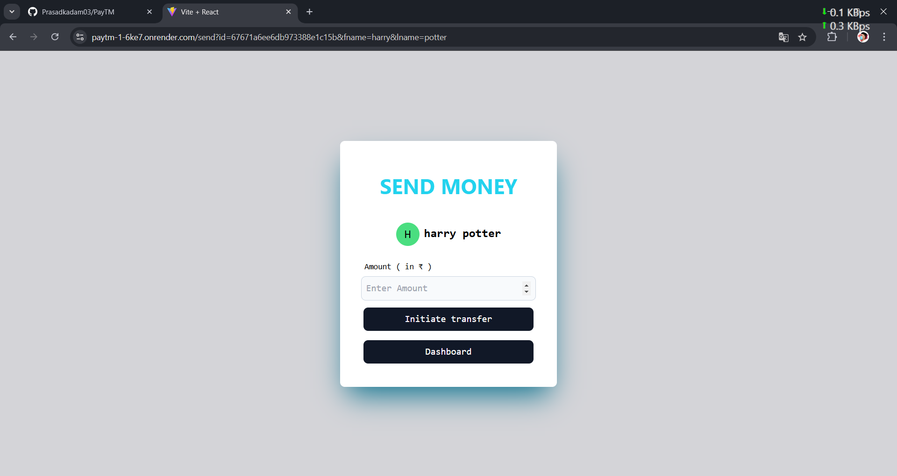

# PayTM Clone

A web-based application inspired by PayTM, built with modern web technologies to replicate core functionalities of an e-wallet system. This project demonstrates a full-stack implementation, utilizing React for the frontend and a robust backend architecture.

---

## Screenshots

Here are some screenshots of the application:

### Home Page


### DashBoard


### Transaction Page


## Features

- **Full Stack Application**: Developed a Full Stack mock payment application using ReactJS, NodeJS, ExpressJS, TailwindCSS, and MongoDB.
- **Real-Time Transactions**: Implemented real-time transactions enabling users to send money to others. Rollback entire transactions if any error occurs midway and update balances in real-time.
- **Data Management**: Used MongoDB for user data and transaction storage, implementing CRUD operations and Zod for input validation.
- **User Authentication**: Secure login and registration system.

---

## Tech Stack

### Frontend:
- React
- Vite
- Tailwind CSS

### Backend:
- Node.js
- Express.js
- MongoDB

### Deployment:
- Render (for live hosting)

---

## Live Demo

Check out the live application: [PayTM Clone](https://paytm-1-6ke7.onrender.com)

---

## Getting Started

Follow these steps to set up the project locally.

### Prerequisites

Ensure you have the following installed on your system:
- Node.js (v16 or higher)
- npm (v7 or higher)
- MongoDB (local or cloud instance)

### Installation

1. Clone the repository:
   ```bash
   git clone https://github.com/Prasadkadam03/PayTM.git
   cd PayTM
   ```

2. Navigate to the backend directory and install dependencies:
   ```bash
   cd backend
   npm install
   ```

3. Navigate to the frontend directory and install dependencies:
   ```bash
   cd ../frontend
   npm install
   ```

4. Set up environment variables:
   - Create a `.env` file in the `backend` directory.
   - Add the following variables:
     ```env
     MONGO_URI=<your-mongodb-uri>
     PORT=5000
     JWT_SECRET=<your-secret-key>
     ```

### Running the Application

1. Start the backend server:
   ```bash
   cd backend
   npm start
   ```

2. Start the frontend development server:
   ```bash
   cd ../frontend
   npm run dev
   ```

3. Open your browser and navigate to `http://localhost:3000` to view the application.

---

## Project Structure

```
PayTM
├── backend
│   ├── controllers
│   ├── models
│   ├── routes
│   └── server.js
├── frontend
│   ├── src
│   │   ├── components
│   │   ├── pages
│   │   ├── styles
│   │   └── App.jsx
└── README.md
```

---

## Contribution Guidelines

Contributions are welcome! Please follow these steps:

1. Fork the repository.
2. Create a new branch:
   ```bash
   git checkout -b feature-name
   ```
3. Make your changes and commit:
   ```bash
   git commit -m "Description of changes"
   ```
4. Push to the branch:
   ```bash
   git push origin feature-name
   ```
5. Create a pull request.

---


## Acknowledgments

- Inspiration: PayTM
- Frameworks: React, Node.js
- Hosting: Render

---

## Contact

Developed by [Prasad Kadam](https://linkedin.com/in/prasadkadam03/).

For any inquiries or feedback, email at [prasadkadam29503@gmail.com](mailto:prasadkadam29503@gmail.com).
